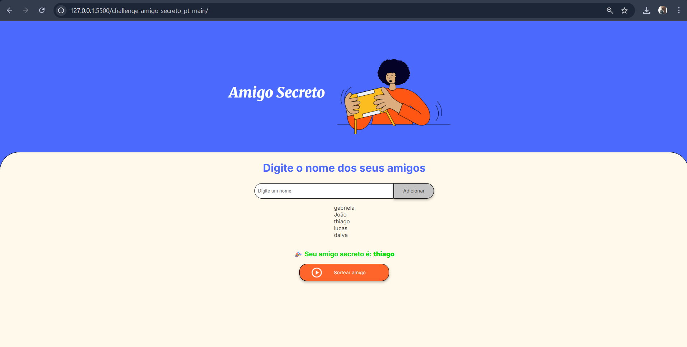

# 🎁 Projeto Amigo Secreto

Este projeto é um **Amigo Secreto online** feito em JavaScript, HTML e CSS.  
Ele permite que você crie uma lista de amigos, adicione os nomes que vão participar e, em seguida, realize o sorteio para descobrir quem tirou quem.  

O objetivo principal deste projeto é **praticar lógica de programação**, manipulação de arrays e elementos do DOM, além de treinar a criação de uma interface simples e interativa.

### Funcionalidades principais:
- Adicionar amigos na lista com validação para evitar nomes vazios ou repetidos.
- Visualizar a lista completa de amigos cadastrados.
- Sortear aleatoriamente um amigo secreto e mostrar o resultado na tela.
- Mensagens de alerta quando há erros ou validações não cumpridas.

---

## 🖼️ Demonstração da tela

---

## Projeto

Você pode ver o projeto funcionando clicando aqui:  
[🔗 Abrir projeto](https://gabrielacoelho98.github.io/amigo-secreto/)

---

## 🛠️ Tecnologias usadas
- **HTML** → estrutura da página  
- **CSS** → estilos (opcional)  
- **JavaScript** → lógica de adicionar nomes e realizar o sorteio  

---

## 📌 Aprendizados
Neste projeto pratiquei:
- Manipulação de elementos com **DOM** (`getElementById`, `innerHTML`).  
- Uso de **arrays** para armazenar dados.  
- Laços de repetição (**for**) e funções simples.  
- Uso de **Math.random()** para realizar o sorteio.  

---

## 👨‍💻 Autor
Feito com ❤️ por [Gabriela Coelho](https://www.linkedin.com/in/gabrielacoelho98/)
